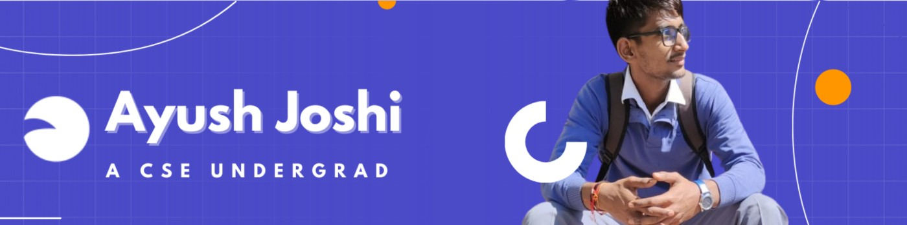

<h1 align="center">Hi, I'm Ayush Joshi</h1>

  

<h3 align="center">
MERN Stack Developer • Building in Public • Posting till I get a job
</h3>

Focused on becoming industry-ready through real projects, freelancing, and consistent learning.

---

## About Me

- MERN Stack Developer from India  
- Building real projects every week  
- Preparing for interviews and GATE  
- Open to freelance and job opportunities  
- Currently building an E-commerce platform  
- Sharing daily development progress publicly  

---

## Tech Stack

Frontend  
React • JavaScript • HTML • CSS • Tailwind  

Backend  
Node.js • Express • MongoDB • REST APIs  

Tools and DevOps  
Git • GitHub • Postman • VS Code • Docker  

---

## GitHub Stats

  

  

---

## Contribution Activity

  

---

## Featured Projects

### E-commerce Platform
Full-stack MERN application with authentication, RBAC, and admin features  

### Regal Rentals
Online clothing rental store built with MERN  

### MERN Chat Application
Real-time chat application using MERN stack and WebSockets  

---

## Connect With Me

LinkedIn  
www.linkedin.com/in/ayush-joshi-57657421b  

Email  
joshiayush00712345@gmail.com  

---

## Current Mission

Build → Learn → Improve → Repeat  
Posting every day until I get a job

---

From <a href="https://github.com/AyushJoshi123">Ayush Joshi</a>

